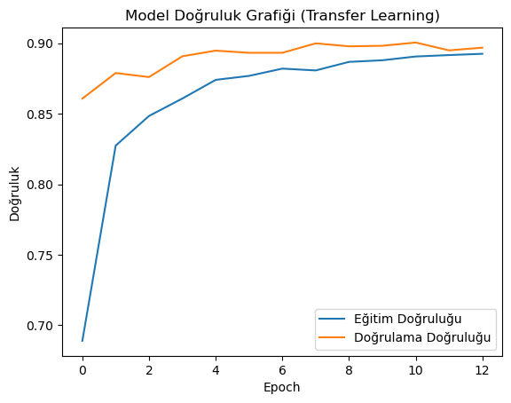
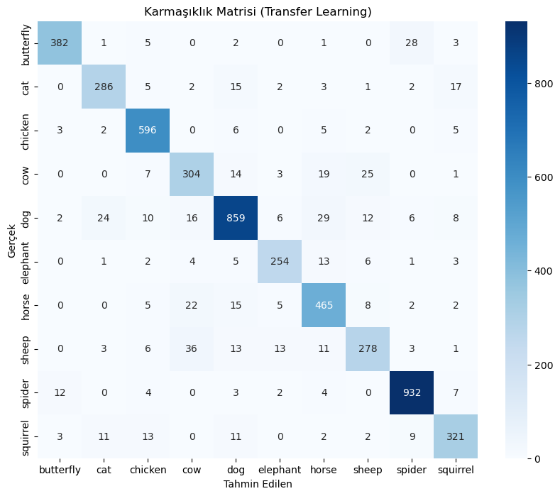
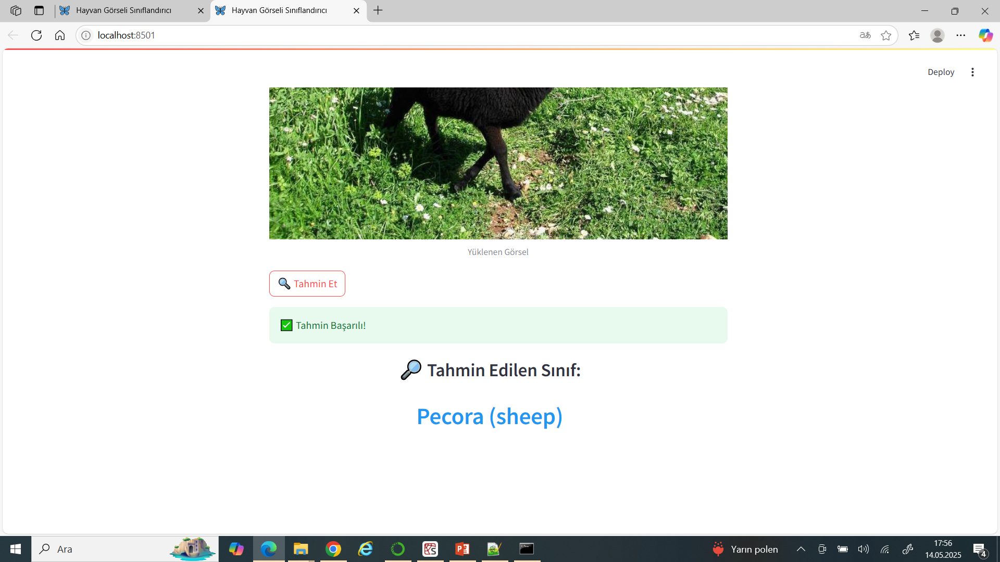

# 🐾 Hayvan Görüntü Sınıflandırma Uygulaması (Transfer Learning + Streamlit Arayüz)

Bu proje, farklı hayvan türlerini içeren görselleri sınıflandırmak için **Transfer Learning (MobileNetV2)** kullanılarak geliştirilmiş bir derin öğrenme modelini içerir. Ayrıca kullanıcıların kendi görsellerini yükleyip sınıflandırma sonucunu anında görebilecekleri **Streamlit tabanlı** bir arayüz sunulmuştur.

## 🔧 Kullanılan Teknolojiler

- Python
- TensorFlow / Keras
- MobileNetV2 (Transfer Learning)
- Streamlit (Arayüz)
- Matplotlib & Seaborn (Görselleştirme)
- Scikit-learn (Analiz)

---

## 📁 Proje Yapısı

```
hayvan-siniflandirma/
├── raw-img/               # Eğitim ve doğrulama görselleri (alt klasörler: cat, dog, vs.)
├── transfer_model.keras   # Eğitilen model dosyası
├── app.py                 # Streamlit arayüz uygulaması
├── README.md              # Bu dökümantasyon dosyası
```

---

## 🚀 Modeli Eğitme

```python
# Eğitim için ana adımlar:
- MobileNetV2 modeli yüklenip üst katmanları dondurulur
- GlobalAveragePooling2D, Dense, Dropout ve sınıflandırma katmanı eklenir
- ImageDataGenerator ile veri artırma uygulanır
- Erken durdurma ile eğitim süreci optimize edilir
```

Model eğitildikten sonra `transfer_model.keras` olarak kaydedilir.

---

## 📈 Model Performansı (Örnek Sonuç)

Model `5232` adet doğrulama verisi üzerinde test edildi. Örnek sınıflandırma sonuçları:

| Sınıf       | Precision | Recall | F1-Score | Örnek Sayısı |
|-------------|-----------|--------|----------|--------------|
| Butterfly   | 0.95      | 0.91   | 0.93     | 422          |
| Dog         | 0.91      | 0.88   | 0.90     | 972          |
| Spider      | 0.95      | 0.97   | 0.96     | 964          |
| Sheep       | 0.83      | 0.76   | 0.80     | 364          |
| **Ortalama**| **0.88**  | **0.88**| **0.88** | -            |

Ayrıca karmaşıklık matrisi ve sınıflandırma raporu matplotlib ile görselleştirilmiştir.
![Sınıflandırma raporu] (siniflandirma.png)


---
## 📊 Model Doğruluk Grafiği



## 📊 Karmaşıklık matrisi Grafiği



## 🌐 Arayüzü Çalıştırma

Kendi test görselinizi yüklemek için arayüzü başlatın:

### 1. Gereksinimleri yükle

```bash
pip install -r requirements.txt
```

> Eğer `requirements.txt` yoksa aşağıdaki temel kütüphaneleri manuel yükleyebilirsin:

```bash
pip install streamlit tensorflow matplotlib seaborn scikit-learn
```

### 2. Arayüzü başlat

```bash
streamlit run app.py
```

> 📌 Not: `app.py` ve `transfer_model.keras` **aynı klasörde** olmalıdır.  
> Komutu çalıştırdığınız terminal, bu klasörde açık olmalıdır.

---

## 🖼️ Arayüz Özellikleri

- 📁 Görsel yükleyerek sınıf tahmini yapabilirsiniz  
- 🧠 Eğitilen model arka planda otomatik yüklenir  
- 📊 Tahmin edilen sınıf ve olasılık kullanıcıya anlık gösterilir  

---

## 📌 Notlar

- Model, önceden eğitilmiş MobileNetV2 ağı üzerine inşa edilmiştir  
- Eğitim sırasında veri artırma teknikleri kullanılmıştır (rotation, zoom, flip, vs.)  
- Arayüz basit ama kullanıcı dostu olacak şekilde tasarlanmıştır  

## 📌 Arayüz görselleri



## 📌 demo video

